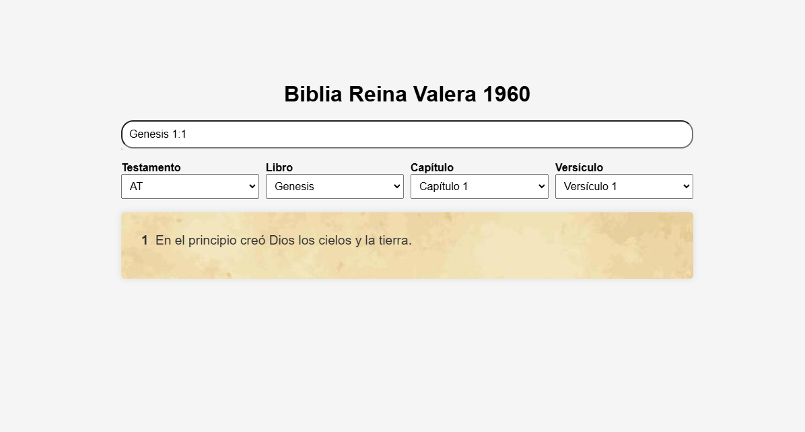

# 📖 Biblia RVR1960 Web App

## Descripción

Biblia RVR1960 Web App es una aplicación diseñada para facilitar la lectura y búsqueda en la Biblia Reina-Valera 1960 de una forma intuitiva y atractiva. La aplicación permite a los usuarios seleccionar fácilmente libros, capítulos y versículos, realizar búsquedas de versículos específicos o rangos de versículos y navegar entre capítulos y libros. La interfaz de usuario incluye un fondo de textura de papiro para dar un aspecto visual que recuerda los antiguos manuscritos bíblicos.

## Screenshot

La siguiente imagen muestra la apariencia y funcionalidad de la Web App:

